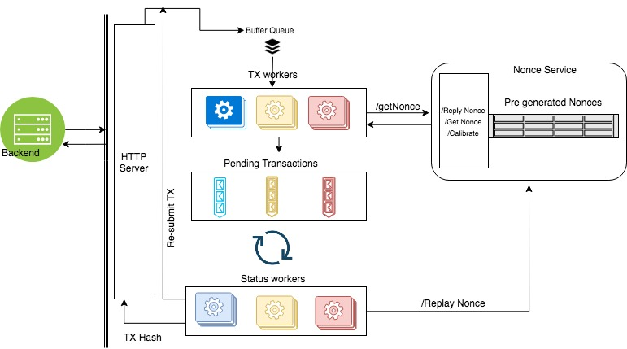

# Datum Transaction Broker

### Preface

The Datum Transaction Broker is a singleton transaction manager for Ethereum and Ethereum style networks like the Datum Network and other private Ethereum networks. 

The transaction broker is capable of receiving many parallel transaction requests and ensure processing of transactions through a single ethereum account, in the right order, calculating and updating the Nonce of each transaction as required. It implements a Nonce queue system and transaction monitoring to process high volume batch transactions in the shortest time possible and with the lowest Gas costs possible depending on configuration.   

During our work with web3 we faced the famous nonce issue.

Assuming we have 3 concurrent transactions A,B, and C from one single ethereum account. If those 3 transaction are executed in order (synchronously) there are no issues. However, once we are dealing with concurrent transactions determining and managing the right Nonce for each transaction becomes an issue.

The transaction broker solves this problem. 

### Features

1) Nonce provider that can handle multiple requests sent in the same time

2) Nonce provider keeps track of pending transactions and handles transaction gap scenarios

3) In case of transaction broker instance crash Nonce provider service can pick up from crash point, as well as sync and review current pending transactions and nonces, persisted to redis

4) Nonce provider does not issue transactions more than Max number of pending transactions per mining node.

5) In case of mining Node crash all the pending transactions residing on the pool might be removed, Nonce provider has to handle this case.

6) Nonce provider can manage multiple ethereum accounts at once to handle high transaction volumes.

### Getting Started

```console
npm install datum-transaction-service
```
```javascript
var transactionBroker = require datum-transaction-service; 
transactionBroker.config({
  "redisUrl": "https://127.0.0.1"
})
transactionBroker.queueTransaction()
```

### Architectural overview


##### Nonce Service
Mainly responsible of generating nonces and replay them if requested by status workers.

1) once Transaction service start, Nonce service will look into the current pending transaction  (executed transactions) and fetch current reported nonce count by mining nodes.

2) Once calibration occur (Max nonce count), it will generate additional nonces as long current length of nonce array <= 60

3) Nonce service can "replay" nonces provided by status workers

##### Transaction workers

Responsible of Fetching transaction from buffer queue, and signing it with their corresponding account PK.

Each Transaction worker is initialised with an account object containing address, account private key, and is used to sign incoming transactions.

Once a transaction worker sign and submit a transaction, it move the transaction to pending transaction queues that correspond to the TX worker, for example if we have 3 transaction workers then we will have 3 pending transaction queues that belong to each transaction worker.

##### Status workers

Responsible of :
1) checking current transaction status
2) If transaction is pending for too long (time limit is defined when we initialise the worker instance) then it will __replay the transaction nonce and resubmit raw transaction object to be resubmitting again by transaction workers__
3) If Status worker received a receipt for the transaction hash, it will mark it as complete and send the hash back as response to the requester

### Deployment

1. Checkout one of following branches to deploy the app to corresponding environment
- `master` branch will be deployed to `datum-transaction-broker-prod`
- `develop` branch will be deployed to `datum-transaction-broker-dev`

2. Run `eb deploy`

Deployed servers can be accessed by ec2 instances within the same VPC only, using internal domain names.
`datum-transaction-broker-dev` can be accessed with `transaction-broker.datum-aws-private.dev`
`datum-transaction-broker-prod` can be accessed with `transaction-broker.datum-aws-private.prod`

____
_Project is still under development, though the remaining effort is not much but in now way it should be used in production environment since this service is meant to serve high load, and require proper testing_
